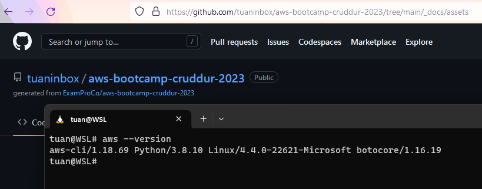

# Week 0 — Billing and Architecture

## Homework

### Logical Architectural Diagram

[Logical Architectural Diagram - Lucid Link](https://lucid.app/lucidchart/a1311a94-bada-4488-90d0-7317ba4cfcbb/edit?viewport_loc=-48%2C-12%2C2074%2C1135%2C0_0&invitationId=inv_83e70598-95ac-4419-be90-271b8317ed12)

### Create a budget

- I created a very small budget to ensure there's no unexpected expense during the bootcamp

### Create an alert

- I wanted to test alert so I set alert value very low and I've got an alert when adding my domain to Route53

### AWS CLI
- As I already installed AWSCLI before to WSL so I just get the screenshot

- However, the steps I did were:
  - sudo apt update
  - sudo apt upgrade
  - sudo apt install awscli

### Cloud Shell
- I used cloud shell to show the budget I created in GUI

